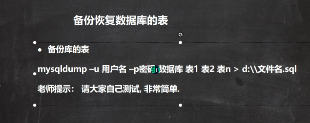
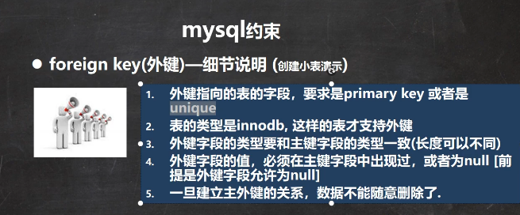
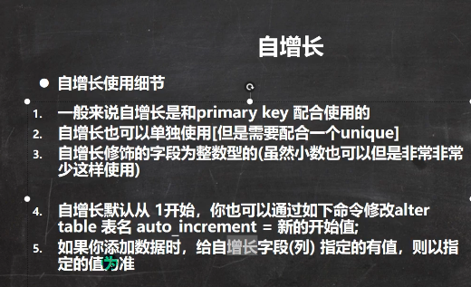

### 创建数据库
> 
```
CREATE DATABASE if not exists hsp_db01;
CREATE DATABASE if not exists hsp_db02
character set=utf8;
CREATE DATABASE if not exists hsp_db03
character set utf8 collate utf8_bin;

```
### 查看，删除数据库
> 显示数据库
> show databases;
> 显示数据库创建语句
> show create database db_name;
> 删除数据库
> drop database if not exists db_name;
### 备份数据库
> 
> 
> 
### 创建表
> 
> 
### mysql列类型
> 
> ### 时间类型
> ```
CREATE TABLE t14 ( 
    birthday DATE ,
    job_time DATETIME,
    login_time TIMESTAMP NOT NULL DEFAULT CURRENT_TIMESTAMP ON update CURRENT_TIMESTAMP 
);

INSERT INTO t14(birthday,job_time) values('2020-11-11','2020-11-11 11:11:11');

```
>  TIMESTAMP NOT NULL DEFAULT CURRENT_TIMESTAMP ON update CURRENT_TIMESTAMP默认当前时间更新
>
```
### mysql function
> count(*),count(col)注意count(col)不会统计为null的情况
> sum(col)返回总和
> max(col),min(col)
> avg(col)
### 字符串函数
> 
> 
### 数学相关函数
> 
> 
### 时间，日期函数
> 
### 加密和系统函数
> 
### 流程控制
> 
> 
### 查询增强
> 
### all,any的使用
> 
> all表示所有，any表示其中一个
### 多列子查询
> 
### 表复制和去重
```
 CREATE TABLE  my_table01(
    id int,
    name varchar(32),
    sal DOUBLE ,
    job VARCHAR (32),
    deptno INT 
);
use hsp_db02;
desc my_table01;
desc emp;

INSERT INTO my_table01 (id,name,sal,job,deptno)
select empno,ename,sal,job,deptno from emp;

SELECT * from my_table01;

-- myself copy
INSERT INTO my_table01
SELECT * from my_table01;

CREATE TABLE my_table02 like emp; -- 创建和emp表结构一样的表

-- 去重my_table02表
-- 1创建一张临时表
CREATE TABLE temp like my_table02;
-- 2插入不重复数据
INSERT INTO temp
select distinct * from my_table02;
select * from temp;
-- 3清除my_table02表
DELETE FROM my_table02;
-- 4插入数据
INSERT INTO my_table02
select * from temp;
-- 5
drop table temp;


```
### 合并查询
> union,union all(不去重)，合并结果集
### 外连接
> 
> select x,y from a left join b on a.n=b.m;
> 
### 主键
>
>具有not null,unique属性,注意unique不能重复但是可以有多个null
### 外键
> 
> ```
> CREATE TABLE class(
    id INT PRIMARY KEY ,
    name VARCHAR (32) NOT NULL DEFAULT ''
);

INSERT INTO class values(100,'java'),(200,'web'),(300,'python');

CREATE TABLE stu(
    stu_id INT PRIMARY KEY ,
    name VARCHAR (32) NOT NULL DEFAULT '',
    class_id INT ,
    FOREIGN KEY (class_id) REFERENCES class(id)
);
> ```
### 自增长
> 
### 索引
> 使用：create index xxx_index on biao(列名);
> 注意：只有指定列名的索引查询才会快
> 
> 
### mysql事务
> 
> 
### 隔离级别
> 
### 视图
> 
> 